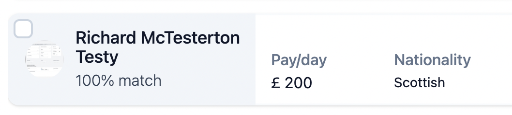

# Mobilise Django/React Technical Assessment

## Get Started

- Fork this repo
- Clone it to your local machine
  
### Install

- [Node.js > 18](https://nodejs.org/en/download/current/)
- [Python > 3.10](https://www.python.org/downloads/release/python-3108/)


You *may* wish to set up a [virtual environment](https://docs.python.org/3/library/venv.html) for python. For unix/bash you can use:
```bash
cd mob-test
python3 -m venv mobtest-venv
source mobtest-venv/bin/activate
python -m pip install -r requirements.txt
```

Then start the server:
```bash
cd mobtest
python manage.py runserver
```

In a new terminal, start the front end using yarn or npm:

```bash
cd frontend/mobtest-react/
yarn install
yarn start
```


## The Task

We have a new client and they have requested the that we store some contractor data, including their applications from previous jobs.

### For Django

Create a **Contractor** model. We need to keep track of the following data:
- user (a relation to the existing user model)
- phone
- nationality
- comment
- pay rate

Create a **ContractorApplication** model. We need to keep track of the following data:
- contractor (a relation to the above Contractor model)
- job name
- start date
- end date


Create up to 3 contractors and 10 contractor applications using your created superuser account

Find a way to serialize this data and send it to the front end. You should not have to worry about CORS or any additional set up, if you have problems, please let us know :)


### For React

Build on the existing react-query code in **api.ts** to get the data that you have created using Django. When clicking the "Open Modal" button, display the fetched contractor applications in a modal using tailwindcss classes. You can get creative here, there is no set design, although something along the lines of this would be nice for each application:



Make sure we can view the contractor, their pay rate, nationality and job name with start/end dates on the application(s)

You are not required to use Typescript here, but it is desired!

## Wrapping up

We would advise not spending too long on this as a project, and have set up most of the boilerplate as we value peoples time. But we also understand there may be some learning required with any new packages and frameworks. Spending any longer than 3 hours on this is not advised!

The main goal of the project is for us to be able to review problem solving skills, talk about thought processes, best practices, while giving you an introduction to how our application is set up.

Good luck :)


*Warning: This app is intended for testing purposes and should not be used for building projects or releasing live applications. There are many security flaws in the way that it has been developed.*


## All done?

Share a link to your repo with us and we'll take a look :eyes:

  
  